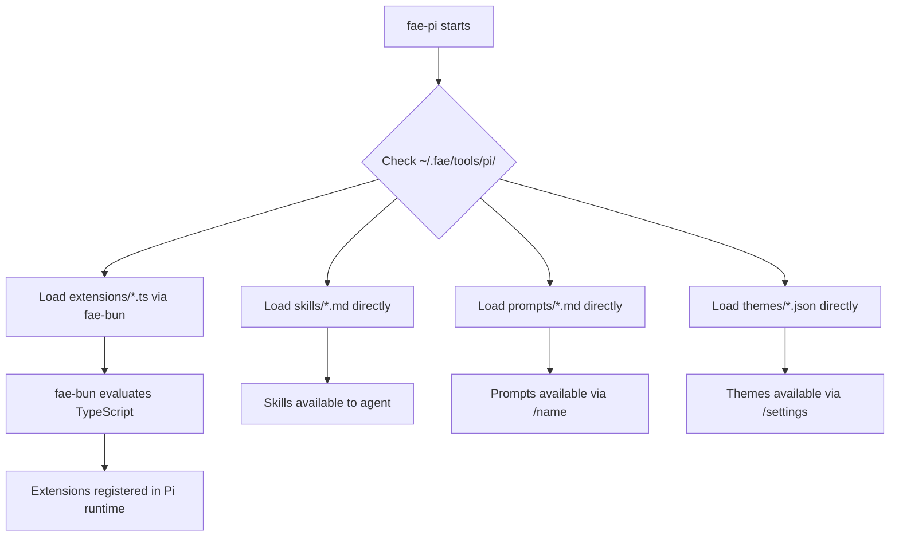

# Fae Tool Bundling System - Technical Specification

> **Document Version**: 1.0  
> **Date**: 2026-02-09  
> **Status**: Ready for Implementation  
> **Target Audience**: MiniMax Engineering Team

---

## Table of Contents

1. [Executive Summary](#1-executive-summary)
2. [System Overview](#2-system-overview)
3. [Tool Inventory](#3-tool-inventory)
4. [Directory Structure](#4-directory-structure)
5. [Build Pipeline](#5-build-pipeline)
6. [Fae-Pi Integration](#6-fae-pi-integration)
7. [Pi Extensibility Strategy](#7-pi-extensibility-strategy)
8. [Tool Manager Implementation](#8-tool-manager-implementation)
9. [Security Considerations](#9-security-considerations)
10. [UX for Non-Technical Users](#10-ux-for-non-technical-users)
11. [Testing Strategy](#11-testing-strategy)
12. [Implementation Phases](#12-implementation-phases)
13. [Open Questions](#13-open-questions)

---

## 1. Executive Summary

### Objective

Bundle validated CLI tools within Fae to enable AI-controlled development operations. All tools are:
- Pre-bundled with Fae releases (no on-demand downloads)
- Namespaced as `fae-<name>` for identification
- Stored in `~/.fae/bin/`
- Built from source in our CI/CD for security auditing

### Key Decisions

| Decision | Choice | Rationale |
|----------|--------|-----------|
| Integration model | Fae controls Pi as a tool | Fae is the "brain"; Pi handles file operations |
| Tool distribution | Pre-bundled in installer | No internet dependency, security audit path |
| JS runtime | Bun | Smaller, faster, can compile npm packages to standalone |
| Package managers | Excluded (for now) | Complexity; revisit in future version |
| Pi extensibility | Hybrid approach | Compiled core + runtime extension loading |

### Tools Included

| Tool | Purpose | Platforms |
|------|---------|-----------|
| `fae-bun` | JavaScript runtime | All |
| `fae-pi` | AI coding assistant | All |
| `fae-fd` | File finder | All |
| `fae-rg` | Text search (ripgrep) | All |
| `fae-uv` | Python package manager | All |

---

## 2. System Overview

### Architecture Diagram

```
┌─────────────────────────────────────────────────────────────────────┐
│                              FAE                                     │
│  ┌─────────────────────────────────────────────────────────────┐    │
│  │                      Voice Pipeline                          │    │
│  │   Mic → VAD → STT → LLM (Fae Brain) → TTS → Speaker         │    │
│  └──────────────────────────┬──────────────────────────────────┘    │
│                             │                                        │
│                             ▼                                        │
│  ┌─────────────────────────────────────────────────────────────┐    │
│  │                    Tool Manager                              │    │
│  │                                                              │    │
│  │   ┌──────────┐  ┌──────────┐  ┌──────────┐  ┌──────────┐   │    │
│  │   │ fae-pi   │  │ fae-fd   │  │ fae-rg   │  │ fae-uv   │   │    │
│  │   │(coding)  │  │(find)    │  │(search)  │  │(python)  │   │    │
│  │   └────┬─────┘  └──────────┘  └──────────┘  └──────────┘   │    │
│  │        │                                                    │    │
│  │        ▼                                                    │    │
│  │   ┌──────────┐                                              │    │
│  │   │ fae-bun  │ ← Runtime for Pi extensions                  │    │
│  │   └──────────┘                                              │    │
│  └─────────────────────────────────────────────────────────────┘    │
└─────────────────────────────────────────────────────────────────────┘

                                │
                                ▼
┌─────────────────────────────────────────────────────────────────────┐
│                         ~/.fae/                                      │
│                                                                      │
│  bin/           tools/pi/          cache/          manifest.toml    │
│  ├─ fae-bun     ├─ extensions/     └─ models/                       │
│  ├─ fae-pi      ├─ skills/                                          │
│  ├─ fae-fd      ├─ prompts/                                         │
│  ├─ fae-rg      ├─ themes/                                          │
│  └─ fae-uv      └─ packages/                                        │
└─────────────────────────────────────────────────────────────────────┘
```

### Interaction Flow

```
User: "Find all TODO comments in my project"

Fae (LLM reasoning):
  1. Parse intent: search for text pattern "TODO"
  2. Select tool: fae-rg (ripgrep)
  3. Execute: fae-rg "TODO" ./

Fae responds: "Found 23 TODO comments across 12 files. Would you like me to list them?"
```

```
User: "Write a function to parse CSV files"

Fae (LLM reasoning):
  1. Parse intent: code generation task
  2. Select tool: fae-pi (coding assistant)
  3. Execute via RPC: spawn fae-pi --mode rpc
  4. Send structured request via stdin
  5. Receive response via stdout
  
Fae responds: "I've created a parse_csv function in utils.py. Here's what it does..."
```

---

## 3. Tool Inventory

### 3.1 Bun Runtime (`fae-bun`)

**Purpose**: JavaScript/TypeScript runtime for Pi extensions and npm packages

| Property | Value |
|----------|-------|
| Source | https://github.com/oven-sh/bun |
| License | MIT |
| Version Policy | Track stable releases |
| Binary Size | ~50MB per platform |

**Platform Binaries**:
| Platform | Binary Name | Download URL Pattern |
|----------|-------------|---------------------|
| macOS arm64 | `bun-darwin-arm64` | `bun-v{VERSION}-darwin-arm64.zip` |
| macOS x64 | `bun-darwin-x64` | `bun-v{VERSION}-darwin-x64.zip` |
| Linux x64 | `bun-linux-x64` | `bun-v{VERSION}-linux-x64.zip` |
| Linux arm64 | `bun-linux-arm64` | `bun-v{VERSION}-linux-arm64.zip` |
| Windows x64 | `bun-windows-x64.exe` | `bun-v{VERSION}-windows-x64.zip` |

**Bundling Notes**:
- Bun is required for Pi extension system
- Also used to compile Pi into standalone executable
- Consider shipping both: compiled `fae-pi` AND standalone `fae-bun`

---

### 3.2 Pi Coding Agent (`fae-pi`)

**Purpose**: AI-powered coding assistant with read/write/edit/bash tools

| Property | Value |
|----------|-------|
| Source | https://github.com/badlogic/pi-mono |
| npm Package | `@mariozechner/pi-coding-agent` |
| License | MIT |
| Version Policy | Track stable releases, security audit before upgrade |
| Compiled Size | ~90MB per platform (includes Bun runtime) |

**Architecture**:
```
@mariozechner/pi-coding-agent
├── @mariozechner/pi-ai          (Multi-provider LLM API)
├── @mariozechner/pi-agent-core  (Agent loop, tool execution)
└── @mariozechner/pi-tui         (Terminal UI)
```

**Built-in Tools**:
| Tool | Function |
|------|----------|
| `read` | Read file contents |
| `write` | Create/overwrite files |
| `edit` | Surgical text replacement |
| `bash` | Execute shell commands |

**Integration Modes**:

| Mode | Command | Use Case |
|------|---------|----------|
| Interactive | `fae-pi` | User-driven sessions |
| Print | `fae-pi -p "prompt"` | Single response, exit |
| JSON | `fae-pi --mode json` | Structured output |
| **RPC** | `fae-pi --mode rpc` | **Fae integration (primary)** |

---

### 3.3 fd (`fae-fd`)

**Purpose**: Fast, user-friendly file finder (alternative to `find`)

| Property | Value |
|----------|-------|
| Source | https://github.com/sharkdp/fd |
| License | MIT/Apache-2.0 |
| Language | Rust |
| Binary Size | ~3-4MB |

**Example Usage**:
```bash
fae-fd -e py           # Find all Python files
fae-fd -e ts -e tsx    # Find TypeScript files
fae-fd README          # Find files named README
fae-fd -H .env         # Include hidden files
```

---

### 3.4 ripgrep (`fae-rg`)

**Purpose**: Blazingly fast text search

| Property | Value |
|----------|-------|
| Source | https://github.com/BurntSushi/ripgrep |
| License | MIT/Unlicense |
| Language | Rust |
| Binary Size | ~5-6MB |

**Example Usage**:
```bash
fae-rg "TODO"              # Search for TODO
fae-rg -i "error" ./logs   # Case-insensitive in logs
fae-rg -t py "import"      # Search only Python files
fae-rg -l "deprecated"     # List files with matches
```

---

### 3.5 uv (`fae-uv`)

**Purpose**: Extremely fast Python package manager

| Property | Value |
|----------|-------|
| Source | https://github.com/astral-sh/uv |
| License | MIT/Apache-2.0 |
| Language | Rust |
| Binary Size | ~15-20MB |

**Example Usage**:
```bash
fae-uv init                    # Initialize Python project
fae-uv add requests            # Add dependency
fae-uv sync                    # Sync environment
fae-uv run python script.py    # Run with environment
fae-uv pip install numpy       # pip compatibility
```

---

## 4. Directory Structure

### 4.1 Installation Layout

```
~/.fae/
├── bin/                                    # Bundled executables
│   ├── fae-bun                            # Bun runtime
│   ├── fae-bun.exe                        # (Windows)
│   ├── fae-pi                             # Pi coding agent (compiled)
│   ├── fae-pi.exe                         # (Windows)
│   ├── fae-fd                             # fd file finder
│   ├── fae-fd.exe                         # (Windows)
│   ├── fae-rg                             # ripgrep
│   ├── fae-rg.exe                         # (Windows)
│   ├── fae-uv                             # Python manager
│   └── fae-uv.exe                         # (Windows)
│
├── tools/                                  # Tool-specific data
│   └── pi/                                # Pi configuration & extensions
│       ├── extensions/                    # User extensions
│       │   ├── my-extension.ts
│       │   └── another-extension/
│       ├── skills/                        # User skills
│       ├── prompts/                       # User prompt templates
│       ├── themes/                        # User themes
│       ├── packages/                      # Installed pi packages
│       │   ├── npm/                       # npm-sourced packages
│       │   └── git/                       # git-sourced packages
│       ├── auth.json                      # API key storage
│       ├── models.json                    # Custom model config
│       └── settings.json                  # Pi settings
│
├── cache/                                  # Cached data
│   ├── models/                            # LLM models
│   └── downloads/                         # Temporary downloads
│
├── config.toml                            # Fae user configuration
└── manifest.toml                          # Tool versions & checksums
```

### 4.2 Manifest Format

```toml
# ~/.fae/manifest.toml

[meta]
schema_version = 1
fae_version = "0.1.0"
built_at = "2026-02-09T12:00:00Z"
platform = "darwin-arm64"

[tools.bun]
version = "1.2.0"
checksum = "sha256:abc123def456..."
source = "https://github.com/oven-sh/bun"

[tools.pi]
version = "0.52.9"
checksum = "sha256:789ghi012jkl..."
source = "npm:@mariozechner/pi-coding-agent"
compiled_with_bun = "1.2.0"

[tools.fd]
version = "10.2.0"
checksum = "sha256:mno345pqr678..."
source = "https://github.com/sharkdp/fd"

[tools.rg]
version = "14.1.1"
checksum = "sha256:stu901vwx234..."
source = "https://github.com/BurntSushi/ripgrep"

[tools.uv]
version = "0.5.15"
checksum = "sha256:yza567bcd890..."
source = "https://github.com/astral-sh/uv"
```

---

## 5. Build Pipeline

### 5.1 Overview

All tools are built in our CI/CD pipeline to ensure:
1. **Security audit** - Source reviewed before inclusion
2. **Reproducibility** - Deterministic builds
3. **Verification** - Checksums recorded in manifest

### 5.2 GitHub Actions Workflow

```yaml
# .github/workflows/build-fae-tools.yml
name: Build Fae Tools

on:
  workflow_dispatch:
    inputs:
      bun_version:
        description: 'Bun version'
        required: true
        default: '1.2.0'
      pi_version:
        description: 'Pi version'
        required: true
        default: '0.52.9'
      fd_version:
        description: 'fd version'
        required: true
        default: '10.2.0'
      rg_version:
        description: 'ripgrep version'
        required: true
        default: '14.1.1'
      uv_version:
        description: 'uv version'
        required: true
        default: '0.5.15'

env:
  BUN_VERSION: ${{ inputs.bun_version }}
  PI_VERSION: ${{ inputs.pi_version }}
  FD_VERSION: ${{ inputs.fd_version }}
  RG_VERSION: ${{ inputs.rg_version }}
  UV_VERSION: ${{ inputs.uv_version }}

jobs:
  # ─────────────────────────────────────────────────────────────────────
  # Job 1: Download and verify Rust-based tools (fd, rg, uv)
  # ─────────────────────────────────────────────────────────────────────
  download-rust-tools:
    strategy:
      matrix:
        include:
          - os: macos-14
            platform: darwin-arm64
            fd_archive: fd-v${{ inputs.fd_version }}-aarch64-apple-darwin.tar.gz
            rg_archive: ripgrep-${{ inputs.rg_version }}-aarch64-apple-darwin.tar.gz
            uv_archive: uv-aarch64-apple-darwin.tar.gz
          - os: macos-13
            platform: darwin-x64
            fd_archive: fd-v${{ inputs.fd_version }}-x86_64-apple-darwin.tar.gz
            rg_archive: ripgrep-${{ inputs.rg_version }}-x86_64-apple-darwin.tar.gz
            uv_archive: uv-x86_64-apple-darwin.tar.gz
          - os: ubuntu-latest
            platform: linux-x64
            fd_archive: fd-v${{ inputs.fd_version }}-x86_64-unknown-linux-gnu.tar.gz
            rg_archive: ripgrep-${{ inputs.rg_version }}-x86_64-unknown-linux-gnu.tar.gz
            uv_archive: uv-x86_64-unknown-linux-gnu.tar.gz
          - os: ubuntu-latest
            platform: linux-arm64
            fd_archive: fd-v${{ inputs.fd_version }}-aarch64-unknown-linux-gnu.tar.gz
            rg_archive: ripgrep-${{ inputs.rg_version }}-aarch64-unknown-linux-gnu.tar.gz
            uv_archive: uv-aarch64-unknown-linux-gnu.tar.gz
          - os: windows-latest
            platform: windows-x64
            fd_archive: fd-v${{ inputs.fd_version }}-x86_64-pc-windows-msvc.zip
            rg_archive: ripgrep-${{ inputs.rg_version }}-x86_64-pc-windows-msvc.zip
            uv_archive: uv-x86_64-pc-windows-msvc.zip

    runs-on: ${{ matrix.os }}
    
    steps:
      - name: Download fd
        run: |
          curl -L "https://github.com/sharkdp/fd/releases/download/v${FD_VERSION}/${{ matrix.fd_archive }}" -o fd.tar.gz
          tar -xzf fd.tar.gz
          mv */fd fae-fd || mv */fd.exe fae-fd.exe
      
      - name: Download ripgrep
        run: |
          curl -L "https://github.com/BurntSushi/ripgrep/releases/download/${RG_VERSION}/${{ matrix.rg_archive }}" -o rg.tar.gz
          tar -xzf rg.tar.gz
          mv */rg fae-rg || mv */rg.exe fae-rg.exe
      
      - name: Download uv
        run: |
          curl -L "https://github.com/astral-sh/uv/releases/download/${UV_VERSION}/${{ matrix.uv_archive }}" -o uv.tar.gz
          tar -xzf uv.tar.gz
          mv uv fae-uv || mv uv.exe fae-uv.exe

      - name: Calculate checksums
        run: |
          sha256sum fae-* > checksums-${{ matrix.platform }}.txt

      - name: Upload artifacts
        uses: actions/upload-artifact@v4
        with:
          name: tools-${{ matrix.platform }}
          path: |
            fae-*
            checksums-*.txt

  # ─────────────────────────────────────────────────────────────────────
  # Job 2: Download Bun runtime
  # ─────────────────────────────────────────────────────────────────────
  download-bun:
    strategy:
      matrix:
        include:
          - platform: darwin-arm64
            bun_target: bun-darwin-arm64
          - platform: darwin-x64
            bun_target: bun-darwin-x64
          - platform: linux-x64
            bun_target: bun-linux-x64
          - platform: linux-arm64
            bun_target: bun-linux-arm64
          - platform: windows-x64
            bun_target: bun-windows-x64

    runs-on: ubuntu-latest
    
    steps:
      - name: Download Bun
        run: |
          curl -L "https://github.com/oven-sh/bun/releases/download/bun-v${BUN_VERSION}/${{ matrix.bun_target }}.zip" -o bun.zip
          unzip bun.zip
          mv ${{ matrix.bun_target }}/bun fae-bun || mv ${{ matrix.bun_target }}/bun.exe fae-bun.exe

      - name: Upload artifact
        uses: actions/upload-artifact@v4
        with:
          name: bun-${{ matrix.platform }}
          path: fae-bun*

  # ─────────────────────────────────────────────────────────────────────
  # Job 3: Compile Pi to standalone executable using Bun
  # ─────────────────────────────────────────────────────────────────────
  compile-pi:
    strategy:
      matrix:
        include:
          - os: macos-14
            platform: darwin-arm64
            bun_target: bun-darwin-arm64
          - os: macos-13
            platform: darwin-x64
            bun_target: bun-darwin-x64
          - os: ubuntu-latest
            platform: linux-x64
            bun_target: bun-linux-x64
          - os: ubuntu-latest
            platform: linux-arm64
            bun_target: bun-linux-arm64
          - os: windows-latest
            platform: windows-x64
            bun_target: bun-windows-x64

    runs-on: ${{ matrix.os }}
    
    steps:
      - name: Setup Bun
        uses: oven-sh/setup-bun@v2
        with:
          bun-version: ${{ env.BUN_VERSION }}

      - name: Create Pi wrapper project
        run: |
          mkdir pi-build && cd pi-build
          bun init -y
          bun add @mariozechner/pi-coding-agent@${PI_VERSION}
          
          # Create entry point that imports Pi CLI
          cat > index.ts << 'EOF'
          #!/usr/bin/env bun
          import "@mariozechner/pi-coding-agent/bin/pi.js";
          EOF

      - name: Compile Pi to standalone
        run: |
          cd pi-build
          bun build ./index.ts \
            --compile \
            --target=${{ matrix.bun_target }} \
            --minify \
            --outfile ../fae-pi

      - name: Verify binary
        run: |
          ./fae-pi --version || ./fae-pi.exe --version

      - name: Upload artifact
        uses: actions/upload-artifact@v4
        with:
          name: pi-${{ matrix.platform }}
          path: fae-pi*

  # ─────────────────────────────────────────────────────────────────────
  # Job 4: Assemble platform bundles
  # ─────────────────────────────────────────────────────────────────────
  assemble-bundles:
    needs: [download-rust-tools, download-bun, compile-pi]
    runs-on: ubuntu-latest
    
    strategy:
      matrix:
        platform:
          - darwin-arm64
          - darwin-x64
          - linux-x64
          - linux-arm64
          - windows-x64

    steps:
      - name: Download all artifacts
        uses: actions/download-artifact@v4
        with:
          pattern: '*-${{ matrix.platform }}'
          merge-multiple: true
          path: bundle

      - name: Create manifest
        run: |
          cd bundle
          cat > manifest.toml << EOF
          [meta]
          schema_version = 1
          fae_version = "${{ github.ref_name }}"
          built_at = "$(date -u +%Y-%m-%dT%H:%M:%SZ)"
          platform = "${{ matrix.platform }}"
          
          [tools.bun]
          version = "${BUN_VERSION}"
          checksum = "sha256:$(sha256sum fae-bun* | cut -d' ' -f1)"
          
          [tools.pi]
          version = "${PI_VERSION}"
          checksum = "sha256:$(sha256sum fae-pi* | cut -d' ' -f1)"
          compiled_with_bun = "${BUN_VERSION}"
          
          [tools.fd]
          version = "${FD_VERSION}"
          checksum = "sha256:$(sha256sum fae-fd* | cut -d' ' -f1)"
          
          [tools.rg]
          version = "${RG_VERSION}"
          checksum = "sha256:$(sha256sum fae-rg* | cut -d' ' -f1)"
          
          [tools.uv]
          version = "${UV_VERSION}"
          checksum = "sha256:$(sha256sum fae-uv* | cut -d' ' -f1)"
          EOF

      - name: Package bundle
        run: |
          cd bundle
          tar -czvf ../fae-tools-${{ matrix.platform }}.tar.gz *

      - name: Upload bundle
        uses: actions/upload-artifact@v4
        with:
          name: fae-tools-${{ matrix.platform }}
          path: fae-tools-${{ matrix.platform }}.tar.gz
```

### 5.3 Security Audit Process

Before updating any tool version:

1. **Review changelog** - Check for security-related changes
2. **Audit dependencies** - Run `npm audit` for Pi, check CVEs for Rust tools
3. **Test in sandbox** - Run tool in isolated environment
4. **Document decision** - Record approval in `tools/audit-log.md`

```markdown
# tools/audit-log.md

## 2026-02-09: Pi 0.52.9

- **Reviewed by**: @engineer
- **Changelog**: https://github.com/badlogic/pi-mono/releases/tag/v0.52.9
- **npm audit**: 0 vulnerabilities
- **Decision**: APPROVED
- **Notes**: Minor bugfixes, no security changes
```

---

## 6. Fae-Pi Integration

### 6.1 Integration Architecture

Fae uses Pi as a **subordinate tool** via RPC mode:

```
┌────────────────────────────────────────────────────────────────┐
│                           FAE                                   │
│                                                                 │
│   User: "Add error handling to the parse function"              │
│                                                                 │
│   ┌───────────────────────────────────────────────────────┐    │
│   │               Fae LLM (Brain)                         │    │
│   │                                                       │    │
│   │   1. Understand intent: code modification             │    │
│   │   2. Decide to use Pi for file editing                │    │
│   │   3. Formulate Pi prompt                              │    │
│   │   4. Execute via RPC                                  │    │
│   └───────────────────────┬───────────────────────────────┘    │
│                           │                                     │
│                           ▼                                     │
│   ┌───────────────────────────────────────────────────────┐    │
│   │               Pi Manager                               │    │
│   │                                                        │    │
│   │   spawn("fae-pi", ["--mode", "rpc", "--no-session"])  │    │
│   │                                                        │    │
│   │   stdin  → JSON request                                │    │
│   │   stdout ← JSON response + events                      │    │
│   └───────────────────────┬───────────────────────────────┘    │
│                           │                                     │
└───────────────────────────┼─────────────────────────────────────┘
                            │
                            ▼
┌───────────────────────────────────────────────────────────────┐
│                        fae-pi                                  │
│                                                                │
│   Receives: {"type": "prompt", "text": "Add error handling..."}│
│                                                                │
│   ┌────────────────────────────────────────────────────────┐  │
│   │  Pi uses its own LLM (Claude/GPT) via configured API   │  │
│   │  Pi executes: read → analyze → edit → verify           │  │
│   └────────────────────────────────────────────────────────┘  │
│                                                                │
│   Returns: {"type": "result", "success": true, "changes": [...]}│
└───────────────────────────────────────────────────────────────┘
```

### 6.2 RPC Protocol

**Start Pi in RPC mode**:
```bash
fae-pi --mode rpc --no-session
```

**Request format** (JSON, one per line):
```json
{"id": 1, "type": "prompt", "text": "Read the file main.py and add type hints"}
{"id": 2, "type": "abort"}
{"id": 3, "type": "settings", "data": {"model": "claude-sonnet-4-20250514"}}
```

**Response format** (JSON lines, streamed):
```json
{"id": 1, "type": "event", "event": "agent_start"}
{"id": 1, "type": "event", "event": "tool_start", "tool": "read", "args": {"path": "main.py"}}
{"id": 1, "type": "event", "event": "tool_end", "tool": "read", "success": true}
{"id": 1, "type": "event", "event": "text_delta", "delta": "I've added type hints..."}
{"id": 1, "type": "event", "event": "agent_end"}
{"id": 1, "type": "result", "success": true}
```

### 6.3 Rust Implementation

```rust
// src/tools/pi.rs

use std::process::Stdio;
use tokio::process::{Child, Command};
use tokio::io::{AsyncBufReadExt, AsyncWriteExt, BufReader};
use serde::{Deserialize, Serialize};

#[derive(Debug, Serialize)]
#[serde(tag = "type")]
pub enum PiRequest {
    #[serde(rename = "prompt")]
    Prompt { id: u64, text: String },
    #[serde(rename = "abort")]
    Abort { id: u64 },
    #[serde(rename = "settings")]
    Settings { id: u64, data: PiSettings },
}

#[derive(Debug, Serialize)]
pub struct PiSettings {
    pub model: Option<String>,
    pub thinking_level: Option<String>,
}

#[derive(Debug, Deserialize)]
#[serde(tag = "type")]
pub enum PiResponse {
    #[serde(rename = "event")]
    Event { id: u64, event: PiEvent },
    #[serde(rename = "result")]
    Result { id: u64, success: bool, error: Option<String> },
}

#[derive(Debug, Deserialize)]
#[serde(tag = "event")]
pub enum PiEvent {
    #[serde(rename = "agent_start")]
    AgentStart,
    #[serde(rename = "agent_end")]
    AgentEnd,
    #[serde(rename = "tool_start")]
    ToolStart { tool: String },
    #[serde(rename = "tool_end")]
    ToolEnd { tool: String, success: bool },
    #[serde(rename = "text_delta")]
    TextDelta { delta: String },
    #[serde(rename = "text_done")]
    TextDone { text: String },
}

pub struct PiSession {
    process: Child,
    request_id: u64,
}

impl PiSession {
    pub async fn start(tool_manager: &ToolManager, cwd: &Path) -> Result<Self> {
        let pi_path = tool_manager.tool_path(Tool::Pi);
        
        let process = Command::new(&pi_path)
            .args(["--mode", "rpc", "--no-session"])
            .current_dir(cwd)
            .stdin(Stdio::piped())
            .stdout(Stdio::piped())
            .stderr(Stdio::piped())
            .spawn()?;
        
        Ok(Self {
            process,
            request_id: 0,
        })
    }

    pub async fn prompt(&mut self, text: &str) -> Result<PiPromptResult> {
        self.request_id += 1;
        let id = self.request_id;
        
        let request = PiRequest::Prompt {
            id,
            text: text.to_string(),
        };
        
        self.send_request(&request).await?;
        self.read_until_result(id).await
    }

    async fn send_request(&mut self, request: &PiRequest) -> Result<()> {
        let stdin = self.process.stdin.as_mut()
            .ok_or_else(|| anyhow::anyhow!("Pi stdin not available"))?;
        
        let json = serde_json::to_string(request)?;
        stdin.write_all(json.as_bytes()).await?;
        stdin.write_all(b"\n").await?;
        stdin.flush().await?;
        
        Ok(())
    }

    async fn read_until_result(&mut self, expected_id: u64) -> Result<PiPromptResult> {
        let stdout = self.process.stdout.as_mut()
            .ok_or_else(|| anyhow::anyhow!("Pi stdout not available"))?;
        
        let mut reader = BufReader::new(stdout);
        let mut line = String::new();
        let mut full_text = String::new();
        let mut tool_calls = Vec::new();

        loop {
            line.clear();
            let bytes_read = reader.read_line(&mut line).await?;
            if bytes_read == 0 {
                anyhow::bail!("Pi process ended unexpectedly");
            }

            let response: PiResponse = serde_json::from_str(&line)?;
            
            match response {
                PiResponse::Event { id, event } if id == expected_id => {
                    match event {
                        PiEvent::TextDelta { delta } => {
                            full_text.push_str(&delta);
                        }
                        PiEvent::ToolStart { tool } => {
                            tool_calls.push(tool);
                        }
                        _ => {}
                    }
                }
                PiResponse::Result { id, success, error } if id == expected_id => {
                    return Ok(PiPromptResult {
                        success,
                        text: full_text,
                        tool_calls,
                        error,
                    });
                }
                _ => {}
            }
        }
    }

    pub async fn abort(&mut self) -> Result<()> {
        self.request_id += 1;
        let request = PiRequest::Abort { id: self.request_id };
        self.send_request(&request).await
    }

    pub fn kill(mut self) -> Result<()> {
        // Attempt graceful shutdown, then force kill
        self.process.start_kill()?;
        Ok(())
    }
}

#[derive(Debug)]
pub struct PiPromptResult {
    pub success: bool,
    pub text: String,
    pub tool_calls: Vec<String>,
    pub error: Option<String>,
}
```

### 6.4 API Key Management

Fae must configure Pi's API keys. Pi supports multiple providers:

```rust
// Before starting Pi session, set environment variables
pub async fn start_pi_with_keys(
    tool_manager: &ToolManager,
    cwd: &Path,
    api_keys: &ApiKeyConfig,
) -> Result<PiSession> {
    let pi_path = tool_manager.tool_path(Tool::Pi);
    
    let mut cmd = Command::new(&pi_path);
    cmd.args(["--mode", "rpc", "--no-session"])
        .current_dir(cwd)
        .stdin(Stdio::piped())
        .stdout(Stdio::piped())
        .stderr(Stdio::piped());
    
    // Set API keys via environment
    if let Some(key) = &api_keys.anthropic {
        cmd.env("ANTHROPIC_API_KEY", key);
    }
    if let Some(key) = &api_keys.openai {
        cmd.env("OPENAI_API_KEY", key);
    }
    if let Some(key) = &api_keys.google {
        cmd.env("GOOGLE_API_KEY", key);
    }
    
    let process = cmd.spawn()?;
    
    Ok(PiSession { process, request_id: 0 })
}
```

---

## 7. Pi Extensibility Strategy

### 7.1 The Challenge

Pi has a rich extension ecosystem:
- **Extensions**: TypeScript modules that add tools, commands, event handlers
- **Skills**: Capability packages with instructions (like MCP)
- **Prompts**: Reusable prompt templates
- **Themes**: Visual customization
- **Packages**: Bundles of the above, installed via `pi install npm:...` or `pi install git:...`

When we compile Pi to a standalone binary with Bun, the standard `pi install` flow breaks because:
1. Compiled binary has embedded node_modules
2. Cannot dynamically install npm packages into the binary

### 7.2 Solution: Hybrid Architecture

We implement a **hybrid approach** that preserves extensibility:

```
┌─────────────────────────────────────────────────────────────────────┐
│                      Pi Extensibility Layers                         │
├─────────────────────────────────────────────────────────────────────┤
│                                                                      │
│  Layer 1: Compiled Core (fae-pi binary)                             │
│  ├── Built-in tools (read, write, edit, bash)                       │
│  ├── Core agent loop                                                │
│  └── Extension loader (reads from filesystem)                       │
│                                                                      │
│  Layer 2: Runtime Extensions (~/.fae/tools/pi/)                     │
│  ├── extensions/*.ts  ← TypeScript, loaded via fae-bun              │
│  ├── skills/*.md      ← Markdown, loaded directly                   │
│  ├── prompts/*.md     ← Markdown, loaded directly                   │
│  └── themes/*.json    ← JSON, loaded directly                       │
│                                                                      │
│  Layer 3: Package Manager (fae-bun based)                           │
│  ├── fae-pi-install npm:@foo/extension                              │
│  └── fae-pi-install git:github.com/user/extension                   │
│                                                                      │
└─────────────────────────────────────────────────────────────────────┘
```

### 7.3 Extension Loading Flow



### 7.4 Extension Loading Implementation

Pi already supports loading extensions from filesystem paths. We configure it via environment:

```rust
// When starting Pi, configure extension directories
pub async fn start_pi_with_extensions(
    tool_manager: &ToolManager,
    cwd: &Path,
) -> Result<PiSession> {
    let pi_path = tool_manager.tool_path(Tool::Pi);
    let bun_path = tool_manager.tool_path(Tool::Bun);
    
    // Pi extension directories
    let fae_home = dirs::home_dir().unwrap().join(".fae");
    let pi_data = fae_home.join("tools").join("pi");
    
    let mut cmd = Command::new(&pi_path);
    cmd.args(["--mode", "rpc", "--no-session"])
        .current_dir(cwd)
        .stdin(Stdio::piped())
        .stdout(Stdio::piped())
        .stderr(Stdio::piped());
    
    // Tell Pi where to find extensions
    // Pi's DefaultResourceLoader reads from:
    // - ~/.pi/agent/ (we redirect to ~/.fae/tools/pi/)
    // - .pi/ in project
    cmd.env("PI_AGENT_DIR", pi_data.to_str().unwrap());
    
    // Tell Pi to use fae-bun for TypeScript execution
    cmd.env("PI_BUN_PATH", bun_path.to_str().unwrap());
    
    let process = cmd.spawn()?;
    Ok(PiSession { process, request_id: 0 })
}
```

### 7.5 Package Installation (Advanced Users)

For advanced users who want to install Pi packages, we provide a wrapper command:

```bash
# fae-pi-install wrapper script
#!/bin/bash

FAE_HOME="${FAE_HOME:-$HOME/.fae}"
PI_DATA="$FAE_HOME/tools/pi"
BUN="$FAE_HOME/bin/fae-bun"

# Handle npm packages
if [[ "$1" == npm:* ]]; then
    PKG="${1#npm:}"
    echo "Installing npm package: $PKG"
    cd "$PI_DATA/packages/npm"
    "$BUN" add "$PKG"
fi

# Handle git packages
if [[ "$1" == git:* ]]; then
    REPO="${1#git:}"
    echo "Cloning git repository: $REPO"
    cd "$PI_DATA/packages/git"
    git clone "https://$REPO"
fi

echo "Package installed. Restart Pi to load extensions."
```

**Rust implementation**:

```rust
// src/tools/pi_packages.rs

pub async fn install_pi_package(
    tool_manager: &ToolManager,
    source: &str,
) -> Result<()> {
    let fae_home = dirs::home_dir().unwrap().join(".fae");
    let pi_packages = fae_home.join("tools").join("pi").join("packages");
    
    if source.starts_with("npm:") {
        let package = source.strip_prefix("npm:").unwrap();
        let npm_dir = pi_packages.join("npm");
        std::fs::create_dir_all(&npm_dir)?;
        
        // Use fae-bun to install npm package
        let bun_path = tool_manager.tool_path(Tool::Bun);
        let output = Command::new(&bun_path)
            .args(["add", package])
            .current_dir(&npm_dir)
            .output()
            .await?;
        
        if !output.status.success() {
            anyhow::bail!("Failed to install npm package: {}", 
                String::from_utf8_lossy(&output.stderr));
        }
    } else if source.starts_with("git:") {
        let repo = source.strip_prefix("git:").unwrap();
        let git_dir = pi_packages.join("git");
        std::fs::create_dir_all(&git_dir)?;
        
        let output = Command::new("git")
            .args(["clone", &format!("https://{}", repo)])
            .current_dir(&git_dir)
            .output()
            .await?;
        
        if !output.status.success() {
            anyhow::bail!("Failed to clone git repository: {}", 
                String::from_utf8_lossy(&output.stderr));
        }
    } else {
        anyhow::bail!("Unknown package source: {}. Use npm: or git: prefix.", source);
    }
    
    Ok(())
}
```

### 7.6 Extension Discovery

When Pi starts, it discovers extensions from multiple locations:

```
Priority (highest to lowest):
1. CLI arguments: --extension <path>
2. Project-local: .pi/extensions/
3. User global: ~/.fae/tools/pi/extensions/
4. Installed packages: ~/.fae/tools/pi/packages/*/extensions/
```

**Configuration in settings.json**:

```json
{
  "extensions": [
    "~/.fae/tools/pi/extensions/my-extension.ts",
    "~/.fae/tools/pi/packages/npm/node_modules/@foo/pi-tools"
  ],
  "skills": [
    "~/.fae/tools/pi/skills/"
  ],
  "prompts": [
    "~/.fae/tools/pi/prompts/"
  ]
}
```

### 7.7 Security Warning for Extensions

Extensions run with **full system access**. Fae should warn users:

```rust
pub async fn install_pi_package_with_warning(
    tool_manager: &ToolManager,
    source: &str,
    ui: &mut dyn UserInterface,
) -> Result<()> {
    let warning = format!(
        "⚠️  Security Warning\n\n\
        You are about to install a Pi package from:\n  {}\n\n\
        Pi packages can execute arbitrary code with full system access.\n\
        Only install packages from sources you trust.\n\n\
        Continue? [y/N]",
        source
    );
    
    if !ui.confirm(&warning).await? {
        return Ok(());
    }
    
    install_pi_package(tool_manager, source).await
}
```

---

## 8. Tool Manager Implementation

### 8.1 Module Structure

```
src/tools/
├── mod.rs              # Public API
├── manager.rs          # ToolManager implementation
├── manifest.rs         # Manifest parsing
├── pi.rs               # Pi-specific integration
├── pi_packages.rs      # Pi package management
└── error.rs            # Tool errors
```

### 8.2 Core Types

```rust
// src/tools/mod.rs

mod manager;
mod manifest;
mod pi;
mod pi_packages;
mod error;

pub use manager::ToolManager;
pub use manifest::{Manifest, ToolInfo};
pub use pi::{PiSession, PiRequest, PiResponse, PiEvent, PiPromptResult};
pub use pi_packages::install_pi_package;
pub use error::ToolError;

/// Supported tools
#[derive(Debug, Clone, Copy, PartialEq, Eq, Hash)]
pub enum Tool {
    Bun,
    Pi,
    Fd,
    Rg,
    Uv,
}

impl Tool {
    pub const ALL: &'static [Tool] = &[
        Tool::Bun,
        Tool::Pi,
        Tool::Fd,
        Tool::Rg,
        Tool::Uv,
    ];

    pub fn binary_name(&self) -> &'static str {
        match self {
            Tool::Bun => "fae-bun",
            Tool::Pi => "fae-pi",
            Tool::Fd => "fae-fd",
            Tool::Rg => "fae-rg",
            Tool::Uv => "fae-uv",
        }
    }

    pub fn display_name(&self) -> &'static str {
        match self {
            Tool::Bun => "Bun",
            Tool::Pi => "Pi",
            Tool::Fd => "fd",
            Tool::Rg => "ripgrep",
            Tool::Uv => "uv",
        }
    }

    pub fn description(&self) -> &'static str {
        match self {
            Tool::Bun => "Fast JavaScript runtime",
            Tool::Pi => "AI coding assistant",
            Tool::Fd => "Fast file finder",
            Tool::Rg => "Fast text search",
            Tool::Uv => "Python package manager",
        }
    }
}
```

### 8.3 Tool Manager

```rust
// src/tools/manager.rs

use std::path::PathBuf;
use tokio::process::Command;
use crate::tools::{Tool, Manifest, ToolError};

pub struct ToolManager {
    fae_home: PathBuf,
    manifest: Manifest,
}

impl ToolManager {
    /// Initialize tool manager, loading manifest
    pub fn new() -> Result<Self, ToolError> {
        let fae_home = dirs::home_dir()
            .ok_or(ToolError::NoHomeDirectory)?
            .join(".fae");
        
        let manifest_path = fae_home.join("manifest.toml");
        let manifest = Manifest::load(&manifest_path)?;
        
        Ok(Self { fae_home, manifest })
    }

    /// Get the binary path for a tool
    pub fn tool_path(&self, tool: Tool) -> PathBuf {
        let mut name = tool.binary_name().to_string();
        #[cfg(windows)]
        {
            name.push_str(".exe");
        }
        self.fae_home.join("bin").join(name)
    }

    /// Check if tool is installed
    pub fn is_installed(&self, tool: Tool) -> bool {
        self.tool_path(tool).exists()
    }

    /// Get tool version from manifest
    pub fn tool_version(&self, tool: Tool) -> Option<&str> {
        self.manifest.tool_version(tool)
    }

    /// Get all tool statuses
    pub fn status(&self) -> Vec<ToolStatus> {
        Tool::ALL.iter().map(|&tool| {
            ToolStatus {
                tool,
                installed: self.is_installed(tool),
                version: self.tool_version(tool).map(String::from),
            }
        }).collect()
    }

    /// Execute a tool with arguments
    pub async fn run(
        &self,
        tool: Tool,
        args: &[&str],
    ) -> Result<std::process::Output, ToolError> {
        let path = self.tool_path(tool);
        
        if !path.exists() {
            return Err(ToolError::NotInstalled(tool));
        }

        let output = Command::new(&path)
            .args(args)
            .output()
            .await
            .map_err(|e| ToolError::ExecutionFailed(tool, e))?;

        Ok(output)
    }

    /// Find files using fd
    pub async fn find_files(
        &self,
        pattern: &str,
        path: Option<&str>,
    ) -> Result<Vec<String>, ToolError> {
        let mut args = vec![pattern];
        if let Some(p) = path {
            args.push(p);
        }
        
        let output = self.run(Tool::Fd, &args).await?;
        let stdout = String::from_utf8_lossy(&output.stdout);
        
        Ok(stdout.lines().map(String::from).collect())
    }

    /// Search content using ripgrep
    pub async fn search_content(
        &self,
        pattern: &str,
        path: Option<&str>,
        options: SearchOptions,
    ) -> Result<Vec<SearchResult>, ToolError> {
        let mut args = vec!["--json", pattern];
        
        if options.case_insensitive {
            args.push("-i");
        }
        if let Some(file_type) = &options.file_type {
            args.push("-t");
            args.push(file_type);
        }
        if let Some(p) = path {
            args.push(p);
        }
        
        let output = self.run(Tool::Rg, &args).await?;
        
        // Parse JSON output
        parse_ripgrep_json(&output.stdout)
    }

    /// Start a Pi RPC session
    pub async fn start_pi_session(
        &self,
        cwd: &std::path::Path,
        api_keys: Option<&ApiKeyConfig>,
    ) -> Result<PiSession, ToolError> {
        PiSession::start(self, cwd, api_keys).await
    }

    /// Run uv command
    pub async fn uv(
        &self,
        args: &[&str],
        cwd: Option<&std::path::Path>,
    ) -> Result<std::process::Output, ToolError> {
        let path = self.tool_path(Tool::Uv);
        
        let mut cmd = Command::new(&path);
        cmd.args(args);
        
        if let Some(dir) = cwd {
            cmd.current_dir(dir);
        }
        
        let output = cmd.output().await
            .map_err(|e| ToolError::ExecutionFailed(Tool::Uv, e))?;
        
        Ok(output)
    }
}

#[derive(Debug)]
pub struct ToolStatus {
    pub tool: Tool,
    pub installed: bool,
    pub version: Option<String>,
}

#[derive(Debug, Default)]
pub struct SearchOptions {
    pub case_insensitive: bool,
    pub file_type: Option<String>,
    pub context_lines: Option<usize>,
}

#[derive(Debug)]
pub struct SearchResult {
    pub path: PathBuf,
    pub line_number: usize,
    pub text: String,
}
```

### 8.4 Error Types

```rust
// src/tools/error.rs

use thiserror::Error;
use crate::tools::Tool;

#[derive(Error, Debug)]
pub enum ToolError {
    #[error("Home directory not found")]
    NoHomeDirectory,

    #[error("Tool {0:?} is not installed")]
    NotInstalled(Tool),

    #[error("Failed to load manifest: {0}")]
    ManifestError(String),

    #[error("Failed to execute {0:?}: {1}")]
    ExecutionFailed(Tool, std::io::Error),

    #[error("Tool {0:?} returned error: {1}")]
    ToolError(Tool, String),

    #[error("Pi session error: {0}")]
    PiError(String),

    #[error("Package installation failed: {0}")]
    PackageError(String),
}
```

---

## 9. Security Considerations

### 9.1 Threat Model

| Threat | Mitigation |
|--------|-----------|
| Malicious tool binary | Build from source in CI, verify checksums |
| Supply chain attack | Pin versions, audit before upgrade |
| Malicious Pi extension | Warn users, extension isolation (future) |
| API key exposure | Store encrypted, never log |
| File system access | Pi runs in working directory only |
| Code execution | All execution logged, user approval for sensitive ops |

### 9.2 Build Security

1. **Source verification**: Only build from official repositories
2. **Reproducible builds**: Lock all dependency versions
3. **Checksum verification**: SHA256 for all binaries
4. **Signing**: Code sign macOS/Windows binaries
5. **Audit trail**: Log all version upgrades with approvals

### 9.3 Runtime Security

```rust
/// Security policy for tool execution
pub struct ToolSecurityPolicy {
    /// Directories Pi can access
    pub allowed_paths: Vec<PathBuf>,
    
    /// Commands that require user approval
    pub sensitive_commands: Vec<String>,
    
    /// Whether to sandbox subprocess execution
    pub sandbox_enabled: bool,
}

impl Default for ToolSecurityPolicy {
    fn default() -> Self {
        Self {
            allowed_paths: vec![],  // Current working directory only
            sensitive_commands: vec![
                "rm".to_string(),
                "sudo".to_string(),
                "curl".to_string(),
                "wget".to_string(),
            ],
            sandbox_enabled: false,  // Future feature
        }
    }
}
```

### 9.4 API Key Security

```rust
/// Secure API key storage
pub struct ApiKeyStore {
    /// Path to encrypted key file
    path: PathBuf,
    /// Encryption key derived from machine ID
    encryption_key: [u8; 32],
}

impl ApiKeyStore {
    pub fn new() -> Result<Self, ToolError> {
        let path = dirs::home_dir()
            .ok_or(ToolError::NoHomeDirectory)?
            .join(".fae")
            .join("secrets.enc");
        
        // Derive key from machine-specific data
        let encryption_key = derive_machine_key()?;
        
        Ok(Self { path, encryption_key })
    }

    pub fn store(&self, provider: &str, key: &str) -> Result<(), ToolError> {
        // Encrypt and store
        todo!()
    }

    pub fn retrieve(&self, provider: &str) -> Result<Option<String>, ToolError> {
        // Decrypt and return
        todo!()
    }
}
```

---

## 10. UX for Non-Technical Users

### 10.1 Design Principles

1. **Invisible complexity**: Users never see tool commands
2. **Natural language**: "Find Python files" not "fae-fd -e py"
3. **Progressive disclosure**: Advanced features available but hidden by default
4. **Clear feedback**: Explain what's happening in user terms
5. **Safe defaults**: Destructive operations require confirmation

### 10.2 Tool Abstraction Examples

| User Request | Fae's Internal Action | User-Facing Response |
|--------------|----------------------|---------------------|
| "Find all Python files" | `fae-fd -e py` | "Found 47 Python files in your project" |
| "Search for TODO comments" | `fae-rg "TODO"` | "Found 12 TODO comments. Here are the most important ones..." |
| "Set up Python for this project" | `fae-uv init && fae-uv sync` | "I've set up Python with all your dependencies" |
| "Add error handling to main.py" | Pi RPC session | "I've added try-catch blocks to handle file errors. Here's what changed..." |

### 10.3 Tool Status UI

```
┌─ Fae Development Tools ─────────────────────────────┐
│                                                      │
│  These tools help me work on your code:             │
│                                                      │
│  🔧 Pi Coding Assistant    v0.52.9    ✅ Ready     │
│  🔍 File Finder (fd)       v10.2.0    ✅ Ready     │
│  🔎 Text Search (ripgrep)  v14.1.1    ✅ Ready     │
│  🐍 Python Manager (uv)    v0.5.15    ✅ Ready     │
│                                                      │
│  ℹ️  These are managed automatically by Fae         │
│                                                      │
└──────────────────────────────────────────────────────┘
```

### 10.4 Error Messages

Instead of:
```
Error: fae-rg: regex parse error
```

Show:
```
I couldn't search for that pattern because it contains special 
characters. Try putting it in quotes, or tell me what you're 
looking for in plain language.
```

### 10.5 Permission Prompts

For operations that modify files:

```
┌─ Fae wants to make changes ──────────────────────────┐
│                                                       │
│  I'm about to modify these files:                    │
│                                                       │
│    📝 src/main.py      - Add error handling          │
│    📝 src/utils.py     - Update import statements    │
│    📄 tests/test_main.py - Add new test cases        │
│                                                       │
│  This will improve error handling in your code.      │
│                                                       │
│  [Review Changes]  [Allow]  [Cancel]                 │
│                                                       │
└───────────────────────────────────────────────────────┘
```

---

## 11. Testing Strategy

### 11.1 Unit Tests

```rust
#[cfg(test)]
mod tests {
    use super::*;

    #[test]
    fn test_tool_binary_names() {
        assert_eq!(Tool::Pi.binary_name(), "fae-pi");
        assert_eq!(Tool::Fd.binary_name(), "fae-fd");
    }

    #[test]
    fn test_manifest_parsing() {
        let toml = r#"
            [meta]
            schema_version = 1
            
            [tools.fd]
            version = "10.2.0"
        "#;
        
        let manifest = Manifest::from_str(toml).unwrap();
        assert_eq!(manifest.tool_version(Tool::Fd), Some("10.2.0"));
    }
}
```

### 11.2 Integration Tests

```rust
#[tokio::test]
async fn test_fd_execution() {
    let manager = ToolManager::new().unwrap();
    
    // Create test directory with files
    let temp = tempdir::TempDir::new("fae-test").unwrap();
    std::fs::write(temp.path().join("test.py"), "").unwrap();
    std::fs::write(temp.path().join("test.rs"), "").unwrap();
    
    // Find Python files
    let results = manager.find_files("-e", Some("py"))
        .await
        .unwrap();
    
    assert!(results.iter().any(|r| r.ends_with("test.py")));
    assert!(!results.iter().any(|r| r.ends_with("test.rs")));
}

#[tokio::test]
async fn test_pi_rpc_basic() {
    let manager = ToolManager::new().unwrap();
    let temp = tempdir::TempDir::new("fae-test").unwrap();
    
    let mut session = manager.start_pi_session(temp.path(), None)
        .await
        .unwrap();
    
    // Simple read operation
    std::fs::write(temp.path().join("test.txt"), "Hello").unwrap();
    
    let result = session.prompt("Read the file test.txt").await.unwrap();
    assert!(result.success);
    assert!(result.tool_calls.contains(&"read".to_string()));
    
    session.kill().unwrap();
}
```

### 11.3 CI Test Matrix

```yaml
test:
  strategy:
    matrix:
      os: [macos-14, macos-13, ubuntu-latest, windows-latest]
  
  runs-on: ${{ matrix.os }}
  
  steps:
    - uses: actions/checkout@v4
    
    - name: Install tools bundle
      run: |
        tar -xzf fae-tools-${{ matrix.platform }}.tar.gz -C ~/.fae/
    
    - name: Run unit tests
      run: cargo test --lib
    
    - name: Run integration tests
      run: cargo test --test integration
```

---

## 12. Implementation Phases

### Phase 1: Core Infrastructure (Week 1-2)

- [ ] Create `src/tools/` module structure
- [ ] Implement `ToolManager` basic functionality
- [ ] Implement manifest parsing
- [ ] Set up CI/CD for building tool bundles
- [ ] Download and package Rust tools (fd, rg, uv)
- [ ] Download and package Bun

### Phase 2: Pi Integration (Week 3-4)

- [ ] Compile Pi to standalone using Bun
- [ ] Implement `PiSession` with RPC protocol
- [ ] Implement API key management
- [ ] Test Pi integration with Fae LLM
- [ ] Handle Pi events and responses

### Phase 3: Extensibility (Week 5-6)

- [ ] Configure Pi to read extensions from `~/.fae/tools/pi/`
- [ ] Implement `install_pi_package` for advanced users
- [ ] Document extension installation process
- [ ] Security warnings for third-party extensions

### Phase 4: UX & Polish (Week 7-8)

- [ ] Natural language → tool command mapping
- [ ] Tool status UI in Fae GUI
- [ ] User-friendly error messages
- [ ] Permission prompts for file modifications
- [ ] Testing across all platforms

---

## 13. Open Questions

### 13.1 For Product Decision

1. **Pi model selection**: Should Fae control which LLM Pi uses, or let Pi use its own configuration?
   - Recommendation: Fae provides API keys, but Pi manages its own model selection

2. **Extension installation UI**: Should non-technical users be able to install Pi extensions?
   - Recommendation: Hide by default, available in "Advanced Settings"

3. **Tool updates**: When a new tool version is available, should we auto-update or prompt user?
   - Recommendation: Prompt during Fae updates, never auto-update

### 13.2 For Engineering

1. **Cross-compilation**: Can we cross-compile Pi from one platform to all others?
   - Needs testing: Bun supports cross-compilation, but native modules may break

2. **Pi RPC stability**: Is the RPC protocol stable, or should we use SDK mode?
   - Needs investigation: Check Pi changelog for RPC protocol changes

3. **Extension sandboxing**: Can we sandbox Pi extensions for better security?
   - Future consideration: Deno-style permissions, but complex to implement

---

## Appendix A: Reference Links

- **Bun**: https://bun.sh, https://github.com/oven-sh/bun
- **Pi**: https://github.com/badlogic/pi-mono, https://shittycodingagent.ai
- **fd**: https://github.com/sharkdp/fd
- **ripgrep**: https://github.com/BurntSushi/ripgrep
- **uv**: https://github.com/astral-sh/uv

## Appendix B: Glossary

| Term | Definition |
|------|------------|
| RPC Mode | Remote Procedure Call - Pi runs as subprocess, communicates via JSON stdin/stdout |
| Extension | TypeScript module that adds capabilities to Pi |
| Skill | Markdown document with instructions for Pi, loaded on-demand |
| Package | Bundle of extensions, skills, prompts, themes |
| Manifest | TOML file describing installed tool versions and checksums |
